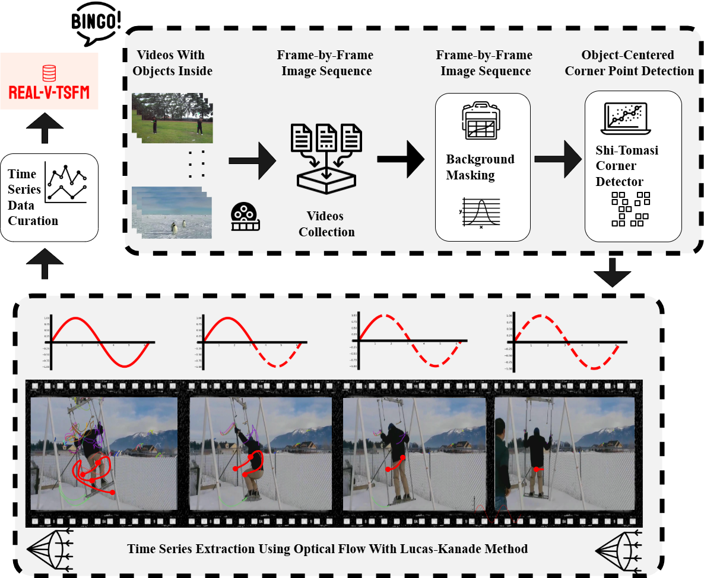

# benchmarking_nature_tsfm

## Introduction

This project supports the research presented in the paper titled  **"How Far Do Time Series Foundation Models Paint the Landscape of Real-World Benchmarks?"** We introduce a novel paradigm for benchmarking time series models, leveraging an extensive collection of existing videos. Specifically, we propose [**REAL-V-TSFM**](https://huggingface.co/datasets/Volavion/real-v-tsfm), an open-source dataset derived exclusively from videos through optical flow techniques. 

The objectives of this dataset are twofold:  
- To rigorously validate the efficacy of the proposed optical flow extraction methodology.  
- To assess the generalizability of Time Series Foundation Models (TSFMs) within diverse real-world contexts.

This work aims to provide the community with a valuable resource and benchmarking framework for advancing time series model evaluation.

<p align="center">
  
</p>


## Datasets

In this study, we primarily utilize the dataset introduced in the article *LaSOT: A High-quality Large-scale Single Object Tracking Benchmark*. The dataset is particularly suitable for time series extraction due to its diverse video content encompassing various subjects such as swings, deer, birds, airplanes, among others. Each category comprises multiple video sequences, providing rich variability.

Our objective extends beyond extracting motion time series of the individual subjects’ components; we also extract background motion sequences caused by camera movement, as illustrated in the figure. This approach allows us to obtain at least two distinct and meaningful time series from each video, while preserving data diversity.

The background motion sequences reflect rhythmic patterns such as human respiration, whereas the motion time series of the subject's components capture intrinsic movement dynamics. For instance, the flapping patterns of a bird’s wings or the motion regularity of a person swinging shown in GIF.

The dataset contains six primary columns:  
- **t**: temporal index of the time series,  
- **target**: the corresponding value of the time series at time \( t \),  
- **axis**: indicates the spatial axis (x or y) represented by the time series,  
- **track_id**: the identifier assigned during optical flow tracking, which is not guaranteed to be unique,  
- **timestamp**: a field we introduced to comply with specific model input requirements (e.g., Google's TimesFM (Time Series Foundation Model)), though it has no intrinsic semantic meaning,  
- **prefix**: denotes the source video from the LaSOT dataset from which the data is derived.


<p align="center">
  
</p>


## Pipelines

Our pipeline is outlined as follows. We begin by collecting video data, which is then segmented into sequences of individual frames. We apply background masking to remove the background, followed by corner detection on the foreground objects. Next, we employ optical flow methods to track the trajectories of the detected corner points. Finally, the collected sequences undergo post-processing. We also analyzed the stationarity of the extracted time series. Our findings indicate that 44\% of the time series are stationary, whereas only 5\% of the time series in the M4 dataset exhibit stationarity.

<p align="center">
  
</p>


## Environment Setup

To install the required dependencies and set up the environment, please use the provided `uv.lock` file.

1. Ensure you have `uv` (or the relevant package manager) installed.

2. Run the following command to install dependencies:

```bash 
uv install
```

This will use the `uv.lock` file to install the exact versions required.

3. After installation, you can start working in the configured environment.

If you encounter any issues, please check your `uv` installation or consult the documentation


