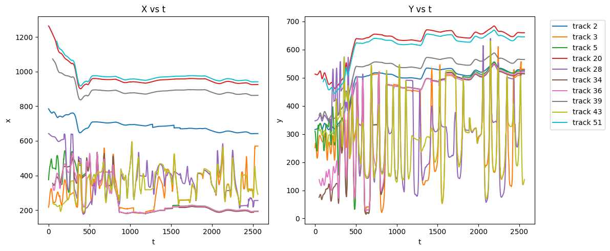
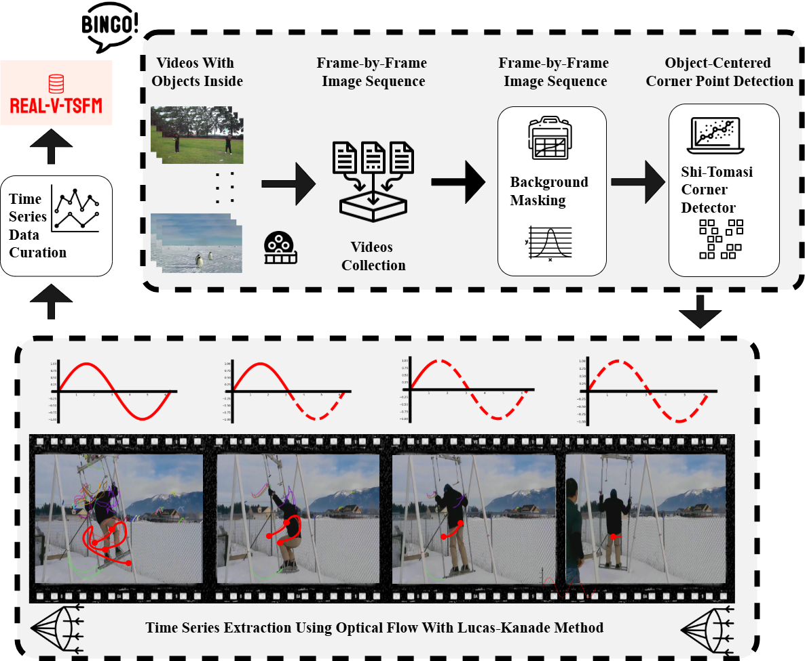

# benchmarking_nature_tsfm

A reusable toolkit and benchmark workflow for extracting time series from videos and evaluating forecasting models.

## Introduction

This project supports the research presented in the paper titled How Far Do Time Series Foundation Models Paint the Landscape of Real-World Benchmarks?. We introduce a novel paradigm for benchmarking time series models, leveraging an extensive collection of existing videos. Specifically, we propose REAL-V-TSFM, an open-source dataset derived exclusively from videos through optical flow techniques:

https://huggingface.co/datasets/Volavion/real-v-tsfm

The objectives of this dataset are twofold:
1. To rigorously validate the efficacy of the proposed optical flow extraction methodology.
2. To assess the generalizability of Time Series Foundation Models (TSFMs) within diverse real-world contexts.

This work aims to provide the community with a valuable resource and benchmarking framework for advancing time series model evaluation.

<p align="center">
  
</p>

<p align="center">
  
</p>

## Datasets

In this study, we primarily utilize the dataset introduced in the article LaSOT: A High-quality Large-scale Single Object Tracking Benchmark. The dataset is particularly suitable for time series extraction due to its diverse video content encompassing various subjects such as swings, deer, birds, and airplanes. Each category comprises multiple video sequences, providing rich variability.

Our objective extends beyond extracting motion time series of individual subjects. We also extract background motion sequences caused by camera movement. This approach allows us to obtain at least two distinct and meaningful time series from each video while preserving data diversity.

The background motion sequences can reflect rhythmic patterns such as respiration-like periodicity, whereas the subject motion series capture intrinsic movement dynamics, such as bird wing flapping or swing motion regularity.

The dataset contains six primary columns:
1. t: temporal index of the time series.
2. target: value at time t.
3. axis: spatial axis, x or y.
4. track_id: identifier assigned during optical flow tracking, not guaranteed globally unique.
5. timestamp: helper field for model input formatting, for example TimesFM.
6. prefix: source video identifier from the LaSOT dataset.

<p align="center">
  
</p>

## Pipeline

The end-to-end pipeline:
1. Collect video data.
2. Segment each video into frame sequences.
3. Apply background masking.
4. Detect feature corners on foreground objects.
5. Track points using optical flow with forward-backward consistency checks.
6. Post-process extracted trajectories into time-series records.

In internal analysis, we observed about 44 percent stationary series in extracted REAL-V-TSFM style data versus around 5 percent in M4, indicating different temporal characteristics between real-world visual motion data and traditional forecasting corpora.

<p align="center">
  
</p>

## Library and CLI

This repository has been refactored into a reusable package with stable command-line interfaces.

Main commands:
1. rvtsfm-extract
2. rvtsfm-eval

Backward compatibility:
1. script/extract_ts_using_optical_flow_with_object_detection.py remains available and now delegates to the new extraction CLI.

## Install

Using uv:

uv sync
uv pip install -e .

Using pip:

pip install -e .

## Quick Start

Extract tracks from a frame directory:

rvtsfm-extract /path/to/sequence/img \
  --output-dir ./outputs/sequence_01 \
  --detector foreground \
  --max-corners 30 \
  --redetect-interval 50

Run generic forecasting evaluation:

rvtsfm-eval ./data/dataset/real-v-tsfm-shortened.jsonl \
  --file-format jsonl \
  --id-col unique_id \
  --target-col target \
  --models linear_trend moving_average last_value \
  --context-length 450 \
  --prediction-length 50 \
  --stride 50 \
  --output-dir ./results/baseline_eval

Generated reports:
1. segment_metrics.csv
2. summary_metrics.csv

## Evaluation Metrics

Unified metrics currently include:
1. MAPE
2. sMAPE
3. Agg_Relative_WQL
4. Agg_Relative_MASE

linear_trend is used as the default reference model for relative metrics.

## Bring Your Own Predictor

You can evaluate any custom model with --custom-predictor module:attribute.

Function style interface:

def my_predictor(history, horizon, **kwargs):
    return prediction_array

Class style interface:

class MyPredictor:
    def __init__(self, **kwargs):
        ...

    def predict(self, history, horizon):
        return prediction_array

Example usage:

rvtsfm-eval ./my_data.csv \
  --models linear_trend custom \
  --custom-predictor my_package.my_module:MyPredictor \
  --custom-predictor-kwargs '{"device":"cuda"}'

## Data Layout Support

The evaluator can read:
1. One-row-per-series with list-like target column.
2. Long format with id, time, target columns.
3. Wide format with multiple numeric columns per row.

Supported formats:
1. csv
2. jsonl
3. json
4. parquet

## Environment Setup Notes

To install the required dependencies and set up the environment, use uv.lock:
1. Ensure uv is installed.
2. Run uv sync.
3. Optionally run uv pip install -e . to install editable package entry points.

If you encounter issues, check uv installation and Python version compatibility.

## GitHub Pages

This repo includes a Pages scaffold under docs and workflow under .github/workflows/pages.yml.

Important: If Pages is not enabled for the repository, deployment will fail with a 404 error in actions/deploy-pages.

Required setup in GitHub:
1. Open repository settings page:
  https://github.com/DobricLilujun/benchmarking_nature_tsfm_backup/settings/pages
2. In Build and deployment, set Source to GitHub Actions.
3. Save settings, then re-run the Deploy GitHub Pages workflow.

Recommended URL pattern:
https://dobriclilujun.github.io/<project-name>/

Example for this repository name:
https://dobriclilujun.github.io/benchmarking_nature_tsfm_backup/

## Notes on Privacy and Redistribution

When publishing extracted datasets or demos:
1. Confirm original video dataset licenses and redistribution policies.
2. Remove private absolute local paths from scripts, logs, and docs.
3. Avoid shipping sensitive metadata in generated files.

## Please cite

```bibtex
@misc{li2025uncoveringzeroshotgeneralizationgaps,
  title={Uncovering Zero-Shot Generalization Gaps in Time-Series Foundation Models Using Real-World Videos},
  author={Lujun Li and Lama Sleem and Yiqun Wang and Yangjie Xu and Niccolo Gentile and Radu State},
  year={2025},
  eprint={2509.26347},
  archivePrefix={arXiv},
  primaryClass={cs.AI},
  url={https://arxiv.org/abs/2509.26347},
}
```
